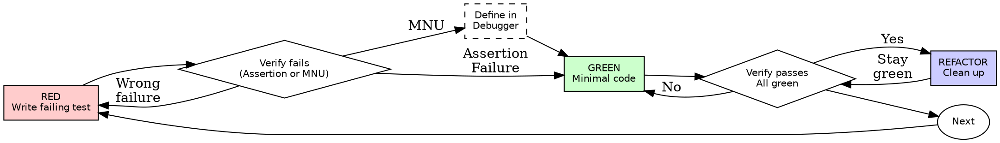

# Test-Driven Development (TDD)

## Overview

Write the test first. Watch it fail. Write minimal code to pass.

**Core principle:** If you didn't watch the test fail (or raise `MessageNotUnderstood`), you don't know if it tests the right thing.

**Violating the letter of the rules is violating the spirit of the rules.**

## When to Use

**Always:**
- New features
- Bug fixes
- Refactoring
- Behavior changes

**Exceptions (ask your human partner):**
- Throwaway scripts (Workspace/Playground)
- Generated code
- FFI definitions

Thinking "skip TDD just this once"? Stop. That's rationalization.

## The Iron Law
*NO PRODUCTION CODE WITHOUT A FAILING TEST FIRST*

Write the method before the test? Delete it. Remove the category. Start over.

**No exceptions:**
- Don't keep it as "reference"
- Don't "comment it out"
- Don't look at it
- Delete means delete

Implement fresh from tests. Period.

## Canon TDD Cycle (Beck's Five Steps)

Beck's canonical cycle has **five** steps, not three. Red-Green-Refactor describes the inner loop; the full cycle wraps it with a scenario list and a repeat step:

1. **Write a test list.** Before coding, enumerate every behavioral scenario you expect to cover: happy path, edge cases, error conditions.
2. **Write one test.** Pick the simplest item from the list. Write a concrete, runnable test with setup, action, and assertion.
3. **Make it pass.** Write the simplest code that turns the test green. Commit whatever sins are necessary — the goal is green, not pretty.
4. **Refactor.** Now that you are green, improve the design. Remove duplication. Improve names. Extract methods. All tests must stay green throughout.
5. **Repeat.** Cross the item off the list. Add any new scenarios you discovered while coding. Pick the next simplest item.

The critical discipline: **never mix step 3 with step 4.** When you are making it pass, do not refactor. When you are refactoring, do not change behavior.

> "Make it work, make it right, make it fast." — Kent Beck (in that order, always)

### Test List Strategy

- Start with the simplest case that can possibly work.
- Progress to boundary conditions.
- End with error conditions.
- As you code, you *will* discover new scenarios. Add them to the list immediately so they are not forgotten.
- Do **not** convert all items into tests at once. Write one test, make it pass, refactor, then write the next.

**Example test list — a Stack:**
```smalltalk
"  - new stack is empty
   - push one element, top returns it
   - push two elements, top returns last pushed
   - pop removes top element
   - pop on empty stack signals error"
```

## Red-Green-Refactor




### RED - Write Failing Test

Write one minimal test method showing what should happen.

<Good>
```smalltalk
testRetriesFailedOperationsThreeTimes
    | attempts result |
    attempts := 0.

result := Retryer retry: [
attempts := attempts + 1.
attempts < 3 ifTrue: [ Error signal: 'fail' ].
'success' ] times: 3.

self assert: result equals: 'success'.
self assert: attempts equals: 3.
```

Clear selector, tests real behavior, asserts specific outcomes.
</Good>

<Bad>
```smalltalk
testRetryer
    | result |
    result := Retryer retry: [ 'success' ] times: 3.
    self assert: result equals: 'success'.
```
Vague name, tests mock implementation, not domain logic.
</Bad>

**Requirements:**
- One behavior per test method
- Clear selector name (starts with test)
- Real code (avoid Mocks unless strictly crossing I/O boundaries)

**Scenario names, not method names.** `testTransferReducesSourceBalance` is better than `testTransfer`. Name tests for the stimulus and the expected outcome — tests are documentation; a newcomer should be able to understand the system by reading only the tests.

**Test one *behavior*, not one *method*.** A single method may need several tests for different scenarios. Conversely, one behavior may span multiple methods — let the scenario drive the test, not the method list.

**Assert on observable behavior, not implementation.** Send messages to the object; assert on what comes back. Do not peek at instance variables.

### Verify RED - Watch It Fail

**MANDATORY. Never skip.**
Run test (calling the pharo mcp command run_class_test).

Confirm:
- Message Not Understood (MNU): If the class/method doesn't exist, this counts as a failure.
- Assertion Failure: If the method exists, the test must fail the assertion.
- Correct Reason: Fails because the feature is missing, not because of a typo.

**Test passes?** You're testing existing behavior. Fix test.

**Test errors unexpectedly?** Fix the setup, re-run until it fails correctly.

## GREEN - Minimal Code

Write simplest code to pass the test.

<Good>
```smalltalk 
Retryer class >> retry: aBlock times: anInteger
    1 to: anInteger do: [ :i |
        [ ^ aBlock value ] 
            on: Error 
            do: [ :ex | i = anInteger ifTrue: [ ex pass ] ] ].
    ^ nil
```
</Good>

<Bad>
```smalltalk
Retryer class &gt;&gt; retry: aBlock times: anInteger
    &quot;Premature optimization or configuration&quot;
    self retry: aBlock times: anInteger delay: 100 milliSeconds strategy: #linear.
```
Over-engineered. YAGNI (You Aren't Gonna Need It)
</Bad>

Don't add features, refactor other code, or "improve" beyond what the test demands.

### Verify GREEN

**MANDATORY. Never skip.**
Run test 

Confirm:
- Current test passes (Green bar).
- No regressions in other tests.
- Transcript is clean.

**Test fails?** Fix code, not test.

**Other tests fail?** Fix now.

### REFACTOR - Clean Up

After green only:
- Remove duplication
- Improve names
- Extract methods (ie shouldRetry:on:)
- *Important:* Keep test green after every change.

### When to Refactor

- **Only when all tests are green.** If any test is red, your job is to make it green, not to restructure.
- **Duplication is a hint, not a command** (Beck). Wait until the pattern is clear before abstracting. Three similar lines are better than a premature abstraction.
- **Focus on code that changes frequently** (Contieri). Stable code with minor imperfections is fine. Refactoring effort should go where it pays off most.
- **Technical debt compounds** (Contieri). Like financial debt, it is initially convenient but increasingly costly. Address heavily-used modules with growing debt early; leave isolated, low-defect modules alone.

### Repeat

Next failing test for next feature.

## Good Tests

| Quality | Good | Bad |
|---------|------|-----|
| **Minimal** | One thing. "and" in name? Split it. | `testValidatesEmailAndDomainAndWhitespace` |
| **Clear** | Name describes behavior | `testWork` |
| **Shows intent** | Demonstrates desired API | Obscures what code should do |
| **Documents** | A newcomer learns the system from the tests | Requires reading the implementation |
| **Independent** | Each test sets up its own world | Shares fixtures or depends on run order |
| **Scenario-named** | `testPopOnEmptyStackSignalsError` | `testPop` |

## Why Order Matters

**"I'll write tests after to verify it works"**

Tests written after code pass immediately. Passing immediately proves nothing:
- Might test wrong thing
- Might test implementation, not behavior
- Might miss edge cases you forgot
- You never saw it catch the bug

Test-first forces you to see the test fail, proving it actually tests something.

**"I already manually tested all the edge cases"**

Manual testing is ad-hoc. You think you tested everything but:
- No record of what you tested
- Can't re-run when code changes
- Easy to forget cases under pressure
- "It worked when I tried it" ≠ comprehensive

Automated tests are systematic. They run the same way every time.

**"Deleting X hours of work is wasteful"**

Sunk cost fallacy. The time is already gone. Your choice now:
- Delete and rewrite with TDD (X more hours, high confidence)
- Keep it and add tests after (30 min, low confidence, likely bugs)

The "waste" is keeping code you can't trust. Working code without real tests is technical debt.

**"TDD is dogmatic, being pragmatic means adapting"**

TDD IS pragmatic:
- Finds bugs before commit (faster than debugging after)
- Prevents regressions (tests catch breaks immediately)
- Documents behavior (tests show how to use code)
- Enables refactoring (change freely, tests catch breaks)

"Pragmatic" shortcuts = debugging in production = slower.

**"Tests after achieve the same goals - it's spirit not ritual"**

No. Tests-after answer "What does this do?" Tests-first answer "What should this do?"

Tests-after are biased by your implementation. You test what you built, not what's required. You verify remembered edge cases, not discovered ones.

Tests-first force edge case discovery before implementing. Tests-after verify you remembered everything (you didn't).

30 minutes of tests after ≠ TDD. You get coverage, lose proof tests work.

## Common Rationalizations

| Excuse | Reality |
|--------|---------|
| "Too simple to test" | Simple code breaks. Test takes 30 seconds. |
| "I'll test after" | Tests passing immediately prove nothing. |
| "Tests after achieve same goals" | Tests-after = "what does this do?" Tests-first = "what should this do?" |
| "Already manually tested" | Ad-hoc ≠ systematic. No record, can't re-run. |
| "Deleting X hours is wasteful" | Sunk cost fallacy. Keeping unverified code is technical debt. |
| "Keep as reference, write tests first" | You'll adapt it. That's testing after. Delete means delete. |
| "Need to explore first" | Fine. Throw away exploration, start with TDD. |
| "Test hard = design unclear" | Listen to test. Hard to test = hard to use. |
| "TDD will slow me down" | TDD faster than debugging. Pragmatic = test-first. |
| "Manual test faster" | Manual doesn't prove edge cases. You'll re-test every change. |
| "Existing code has no tests" | You're improving it. Add tests for existing code. |

## Red Flags - STOP and Start Over

- Code before test
- Test after implementation
- Test passes immediately
- Can't explain why test failed
- Tests added "later"
- Rationalizing "just this once"
- "I already manually tested it"
- "Tests after achieve the same purpose"
- "It's about spirit not ritual"
- "Keep as reference" or "adapt existing code"
- "Already spent X hours, deleting is wasteful"
- "TDD is dogmatic, I'm being pragmatic"
- "This is different because..."

**All of these mean: Delete code. Start over with TDD.**

## Example: Bug Fix

**Bug:** Empty email accepted

**RED**
```smalltalk
testRejectsEmptyEmail
    | response |
    response := FormProcessor submit: { #email -> '' } asDictionary.
    self assert: (response at: #error) equals: 'Email required'.
```

**Verify RED**
Run test.
Result: `AssertionFailure: Expected 'Email required' but got nil` (or MNU if logic missing).

**GREEN**
```smalltalk
FormProcessor >> submit: aDataDictionary
    (aDataDictionary at: #email ifAbsent: ['']) trim isEmpty
        ifTrue: [ ^ { #error -> 'Email required' } asDictionary ].
    "..."
```

**Verify GREEN**
Run test.

**REFACTOR**
Extract validation for multiple fields if needed.

## Example: Invalid-Scenario Guard (Creation Method)

**Behavior:** `Die sided: -5` must be rejected before the object exists.

**Test list addition:** `negative number of sides is rejected with a clear message`.

**RED**
```smalltalk
testNegativeFacesAreNotAllowed
    self
        should: [ Die sided: -5 ]
        raise: InstanceCreationFailed
        withMessageText: 'Number of sides must be strictly positive'.
```

**Verify RED**
Run test. Either MNU (selector missing) or assertion failure (no guard clause yet).

**GREEN**
```smalltalk
Die class >> sided: anAmountOfSides
    anAmountOfSides strictlyPositive
        ifFalse: [ InstanceCreationFailed signal: 'Number of sides must be strictly positive' ].
    ^ self new initializeSided: anAmountOfSides
```

**Verify GREEN**
Run test and the rest of the `DieTest` class — invalid-scenario guard holds, happy path still green.

**REFACTOR**
If several creation methods share the positivity guard, extract a helper on the receiver (e.g., `anAmountOfSides assertStrictlyPositive`) once the duplication is actually present in two or more creation methods.

## Verification Checklist

Before marking work complete:

- [ ] Every new function/method has a test
- [ ] Watched each test fail before implementing
- [ ] Each test failed for expected reason (feature missing, not typo)
- [ ] Wrote minimal code to pass each test
- [ ] All tests pass
- [ ] Output pristine (no errors, warnings)
- [ ] Tests use real code (mocks only if unavoidable)
- [ ] Edge cases and errors covered
- [ ] Invalid-scenario guards in creation methods have `should:raise:withMessageText:` tests
- [ ] Test list tracked throughout — newly-discovered scenarios added, not forgotten

Can't check all boxes? You skipped TDD. Start over.

## When Stuck

| Problem | Solution |
|---------|----------|
| Don't know how to test | Write wished-for API. Write assertion first. Ask your human partner. |
| Test too complicated | Design too complicated. Simplify interface. |
| Must mock everything | Code too coupled. Use dependency injection. |
| Test setup huge | Extract helpers. Still complex? Simplify design. |

## Debugging Integration

Bug found? Write failing test reproducing it. Follow TDD cycle. Test proves fix and prevents regression.

Never fix bugs without a test.

## Testing Anti-Patterns

When adding mocks or test utilities, review the testing anti-patterns below to avoid common pitfalls:
- Testing mock behavior instead of real behavior
- Adding test-only methods to production classes
- Mocking without understanding dependencies
- Coupled tests that depend on execution order or shared state — each test must set up its own world
- Asserting on instance variables instead of the object's observable protocol
- Mocking internal domain logic (mocks belong only at strict I/O boundaries — see the Mocking Policy in `smalltalk-conventions`)

## Final Rule

```
Production code → test exists and failed first
Otherwise → not TDD
```

No exceptions without your human partner's permission.
